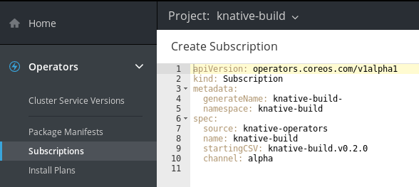
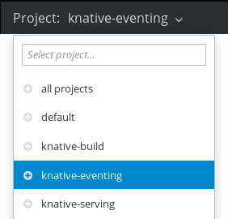

# Knative Dev Preview in OpenShift
Developer Preview 0.2.0
------

> **IMPORTANT:** The functionality introduced by Knative Dev Preview in OpenShift is developer preview only. Red Hat support is not provided, and this release should not be used in a production environment.

> **NOTE ON INSTALLATION:** All of the developer preview components of Knative Dev Preview in OpenShift, including software dependencies and configurations, can be installed by using the script provided by Red Hat in the OpenShift Cloud Functions `knative-operators` repository. The steps for manual installation are also included in this document to provide information about the steps completed by running the script, however the script installation method is recommended.

## Prerequisites

> **IMPORTANT:** You will need cluster administrator privileges to install and use Knative Dev Preview in OpenShift.

### Supported platform versions

| Platform        | Supported versions           |
| ------------- |:-------------:|
| Minishift      | 1.25.0 or newer |

### Hardware requirements

Knative Dev Preview in OpenShift using Minishift requires at least 24GB of memory to run correctly.

If you are running Minishift on your local machine, ensure that virtualization is enabled, as this installation required the use of virtual machines (KVM).

### Installing dependencies

> **IMPORTANT:** Docker and Kubernetes are also required to install and use Knative Dev Preview in OpenShift, however these components are outside the scope of this documentation, and instructions can be found easily online.

#### Installing Minishift

> **NOTE:** If this is not your first installation, and you wish to remove your Minishift profile and reinstall Knative Dev Preview in OpenShift, you can do this using the command
>
>   `$ minishift profile delete knative --force`  

1. Download the latest version of Minishift from the [Minishift Releases page](https://github.com/minishift/minishift/releases)
2. Extract the files.

   Example command for RHEL:   
   `$ sudo tar xvzf minishift-1.28.0-linux-amd64.tgz`  

3. Add the minishift binary to your PATH environment variable.

   Example command for RHEL:  
   `$ sudo cp minishift-1.28.0-linux-amd64/minishift /bin`  

4. Install `libvirt` and `qemu-kvm` on your system.

   Example commands for RHEL:

	 `$ sudo yum install libvirt qemu-kvm`  
	 `$ sudo usermod -a -G libvirt <username>`  
	 `$ newgrp libvirt`  
	 `$ sudo curl -L https://github.com/dhiltgen/docker-machine-kvm/releases/download/v0.10.0/docker-machine-driver-kvm-centos7 -o /usr/local/bin/docker-machine-driver-kvm`  
	 `$ sudo chmod +x /usr/local/bin/docker-machine-driver-kvm`

5. You will need to set the correct configuration before starting Minishift. You can do this by using the commands

   `$ minishift profile set knative`  
	 `$ minishift config set openshift-version v3.11.0`  
	 `$ minishift config set memory 8GB`  
	 `$ minishift config set cpus 4`  
	 `$ minishift config set disk-size 50g`  
	 `$ minishift config set image-caching true`  
	 `$ minishift addons enable admin-user`  
	 `$ minishift addons enable anyuid`  

## Installing Knative Dev Preview in OpenShift via the script provided (recommended)

1. Clone the `knative-operators` repository.

   `$ git clone git@github.com:openshift-cloud-functions/knative-operators.git`  

2. Navigate to the newly cloned repository and run the `install.sh` script.

   `$ ./etc/scripts/install.sh`  

>**NOTE** The installation script takes around 20-30 minutes to complete, depending on your system.

### Accessing the Knative Dev Preview in OpenShift console (user interface)

1. Once the script has completed, set the required environment variables.

   `$ eval $(minishift oc-env)`  
   `$ eval $(minishift docker-env)`

2. Navigate to the OLM repository and start up the user interface using the following command.

	 `$ ./scripts/run_console_local.sh`  

3. Check your IP address by typing `minishift ip` into a new terminal tab or window. Use this IP address with port 9000 appended to access the console from your web browser.

   `http://<minishift-ip>:9000`

## Installing Knative Dev Preview in OpenShift manually

### Installing Operator Lifecycle Manager (OLM)

1. Clone the OLM repository.

   `$ git clone git@github.com:operator-framework/operator-lifecycle-manager.git`  

2. Start Minishift.

   `$ minishift start`  

3. Set the required environment variables.

	 `$ eval $(minishift oc-env)`  
	  `$ eval $(minishift docker-env)`  

4. Login as administrator.

	`$ oc login -u system:admin`  

5. Navigate to the `operator-lifecycle-manager` directory and install the latest OLM release using the following command.

   `$ oc create -f deploy/okd/manifests/latest/`  

>**NOTE** When starting Minishift to install OCF, or completing other tasks,  leave this terminal open and start a new one.

### Installing Istio add-on for Minishift
[See Istio instructions here](https://github.com/minishift/minishift-addons/tree/master/add-ons/istio#istio-add-on)

### Installing Knative Dev Preview in OpenShift on Minishift

1. Start Minishift.

   `$ minishift start`  

2. Set the required environment variables.

   `$ eval $(minishift oc-env)`  
   `$ eval $(minishift docker-env)`  

3. Navigate to the `knative-operators/etc/` directory and run the script

   `$ ./scripts/prep-knative.sh`  

3. Login as administrator.

   `$ oc login -u system:admin`  

4. Install the Knative Dev Preview in OpenShift `knative-operators CatalogSource`.

   `$ oc apply -f https://raw.githubusercontent.com/openshift-cloud-functions/knative-operators/master/knative-operators.catalogsource.yaml`  

### Accessing the Knative Dev Preview in OpenShift console (user interface)

1. Open a new terminal window and set the required environment variables.

   `$ eval $(minishift oc-env)`  
   `$ eval $(minishift docker-env)`

2. Start up the user interface using the following command.

	 `$ ./scripts/run_console_local.sh`  

3. Check your IP address by typing `minishift ip` in a new terminal window or tab. Use this IP address with port 9000 appended to access the console from your web browser.

   `http://<minishift-ip>:9000`

### Installing Knative Operators on Minishift using OLM

#### Knative build

1. In the terminal, use the following command to create the `knative-build` project and namespace.

   `$ oc new-project knative-build`  

2. Ensure that you are in the `knative-build` namespace.

   `$ oc project knative-build`  

3. In the console, the `knative-build` project from the drop-down menu.

     

4. Create a new Subscription, by selecting the **Create Subscription** button for the `knative-build` Operator in the **Package Manifests** tab.

     

5. You will be able to see and edit the configuration of the Subscription being created before you finalize this.

   For more information about Subscription configurations, see the [OLM documentation](https://github.com/operator-framework/operator-lifecycle-manager#discovery-catalogs-and-automated-upgrades).  

     

6. The Subscription will now be created. Once this process is complete, you will see the Subscription information in the **Subscriptions** tab.

7. You can verify the setup by checking that the pods are running by going to the **Workloads** > **Pods** tab.

#### Knative serving

1. In the terminal, use the following command to create the `knative-serving` project and namespace.

   `$ oc new-project knative-serving`  

2. Ensure that you are in the `knative-serving` namespace.

   `$ oc project knative-serving`  

3. Select the `knative-serving` project from the drop-down menu.

      

4. Create a new Subscription, by selecting the **Create Subscription** button for the `knative-serving` Operator in the **Package Manifests** tab.

     

5. You will be able to see and edit the configuration of the Subscription being created before you finalize this.

   For more information about Subscription configurations, see the [OLM documentation](https://github.com/operator-framework/operator-lifecycle-manager#discovery-catalogs-and-automated-upgrades).  

     

6. he Subscription will now be created. Once this process is complete, you will see the Subscription information in the **Subscriptions** tab.

7. You can verify the setup by checking that the pods are running by going to the **Workloads** > **Pods** tab.

#### Knative eventing

1. In the terminal, use the following command to create the `knative-eventing` project and namespace.

   `$ oc new-project knative-eventing`  

2. Ensure that you are in the `knative-eventing` namespace.

   `$ oc project knative-eventing`  

3. Select the `knative-eventing` project from the drop-down menu.

     

4. Create a new Subscription, by selecting the **Create Subscription** button for the `knative-eventing` Operator in the **Package Manifests** tab.

     

5. You will be able to see and edit the configuration of the Subscription being created before you finalize this.

   For more information about Subscription configurations, see the [OLM documentation](https://github.com/operator-framework/operator-lifecycle-manager#discovery-catalogs-and-automated-upgrades).  

     

6. The Subscription will now be created. Once this process is complete, you will see the Subscription information in the **Subscriptions** tab.

7. You can verify the setup by checking that the pods are running by going to the **Workloads** > **Pods** tab.
